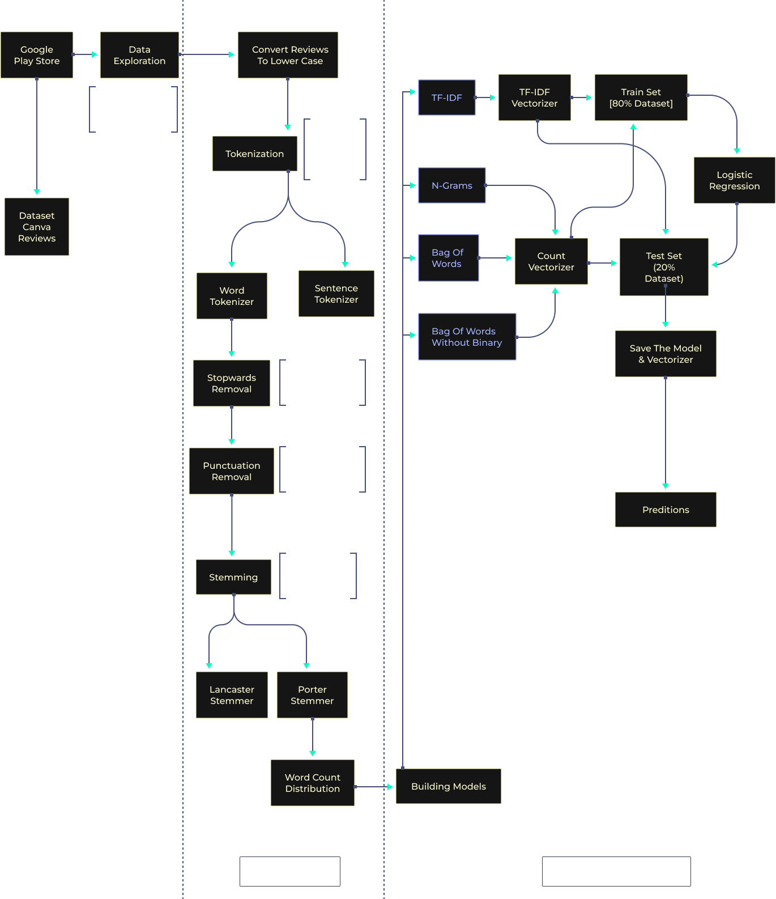

# Text processing and classification using Logistic Regression


This repository contains the code for basic text processing and building a binary text classifier using Logistic Regression



### Installation
To install the dependencies run:
```buildoutcfg
pip install -r requirements.txt
```

### Dataset
The dataset is a custom dataset where reviews about an app are taken from app store and the reviews are classified either as positive or negative

### Train the model
To train the model run:
```buildoutcfg
python Engine.py --file_name Canva_reviews.xlsx --vectorizer bowb --output_name binary_count_vect
```
Here we can use 4 types of vectorizers:
* Bag of Words - `bow`
* Binary Bag of Words - `bowb`
* N-grams - `ng`
* TF-IDF - `tf`

### Predictions
To make prediction on a new review `Its the worst app ever I save my design lts not save`,  run:
```buildoutcfg
python predict.py --text 'Its the worst app ever I save my design lts not save' --model_name binary_count_vect
```
Here `binary_count_vect` is the file name used to save the model and the vectorizer during the training phase

### Note on NLTK Package:
For installing NLTK, use the command `pip install nltk` <br />
After downloading, the NLTK corpus has to be downloaded <br />
Run `import nltk` followed by `nltk.download()` in jupyter notebook <br />
This will open a separate window where you can donwnload the necessary packages <br />
For this project, you will need the following packages:<br />
<ol>
<li>punkt</li>
<li>stopwords</li>
<li>wordnet</li>
</ol>
